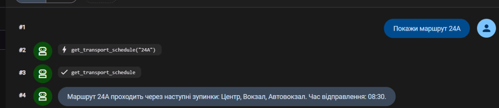
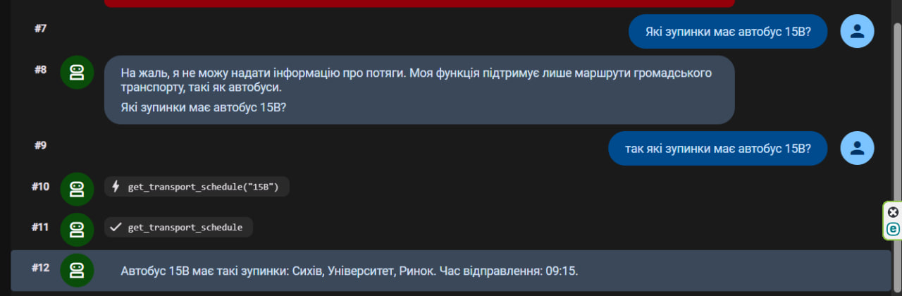

# ВСП «ІТ коледж НУ 'Львівська політехніка'»

# Екзамен
## AI агент з використанням Google ADK

---

## Виконала

**Студентка групи КН-33**  
**Половко Аліна**

---

# Варіант 8

## Тема роботи

Реалізація AI агента для розкладу громадського транспорту з використанням принципів об'єктно-орієнтованого програмування.

---

# Опис проєкту

У даному проєкті реалізовано AI агента для роботи з розкладом громадського транспорту за допомогою Google ADK.

Агент надає інформацію про:
- автобусні маршрути
- зупинки
- станції
- час у дорозі

Проєкт реалізовано мовою Python із використанням принципів ООП.

---

# Реалізовані принципи ООП

## 1. Абстракція

Створено абстрактний клас `Transport` з абстрактним методом `get_schedule()`.

---

## 2. Наслідування

Класи:
- `Bus`
- `Train`

успадковуються від класу `Transport`.

---

## 3. Інкапсуляція

У класі `Schedule` використовується приватний словник:

```python
self.__routes
````

для зберігання маршрутів.

---

## 4. Поліморфізм

Метод:

```python
get_schedule()
```

реалізований по-різному у класах:

* `Bus`
* `Train`

---

# Структура проєкту

```text
exam_variant_8/
│
├── pyproject.toml
├── poetry.lock
├── README.md
├── .gitignore
│
└── transport_agent/
    │
    ├── agent.py
    ├── .env
    └── __init__.py
```

---

# Використані технології

* Python 3.13
* Google ADK
* python-dotenv
* Poetry

---

# Встановлення залежностей

```bash
poetry add google-adk python-dotenv
```

---

# Версія ADK

```bash
adk, version 2.1.0
```

---

# Основні команди ADK

## Створення агента

```bash
poetry run adk create
```

## Запуск агента

```bash
poetry run adk run
```

## Web інтерфейс

```bash
poetry run adk web
```

---

# Запуск проєкту

```bash
poetry run adk web
```

Після запуску web-інтерфейс доступний за адресою:

```text
http://127.0.0.1:8000
```

---

# Приклади запитів до агента

```text
Покажи маршрут 24A
```

```text
Покажи інформацію про потяг T101
```

```text
Покажи маршрут 999
```

---

# Файл poetry.lock

Файл `poetry.lock` використовується для фіксації точних версій усіх залежностей проєкту. Це дозволяє забезпечити однакове середовище виконання на різних комп’ютерах.

---

# Скріншоти роботи агента

## Діалог 1


---

## Діалог 2-3



---


# Висновок

У ході виконання екзаменаційної роботи було створено AI агента для роботи з громадським транспортом за допомогою Google ADK. У проєкті реалізовано основні принципи об'єктно-орієнтованого програмування: абстракцію, наслідування, інкапсуляцію та поліморфізм. Також було створено інструмент для пошуку маршрутів громадського транспорту та налаштовано web-інтерфейс для взаємодії з агентом.

```
```
