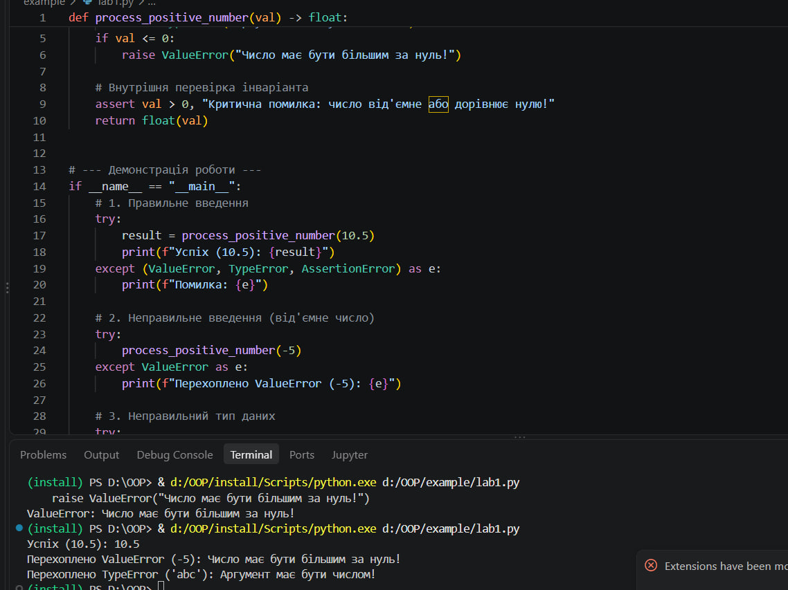
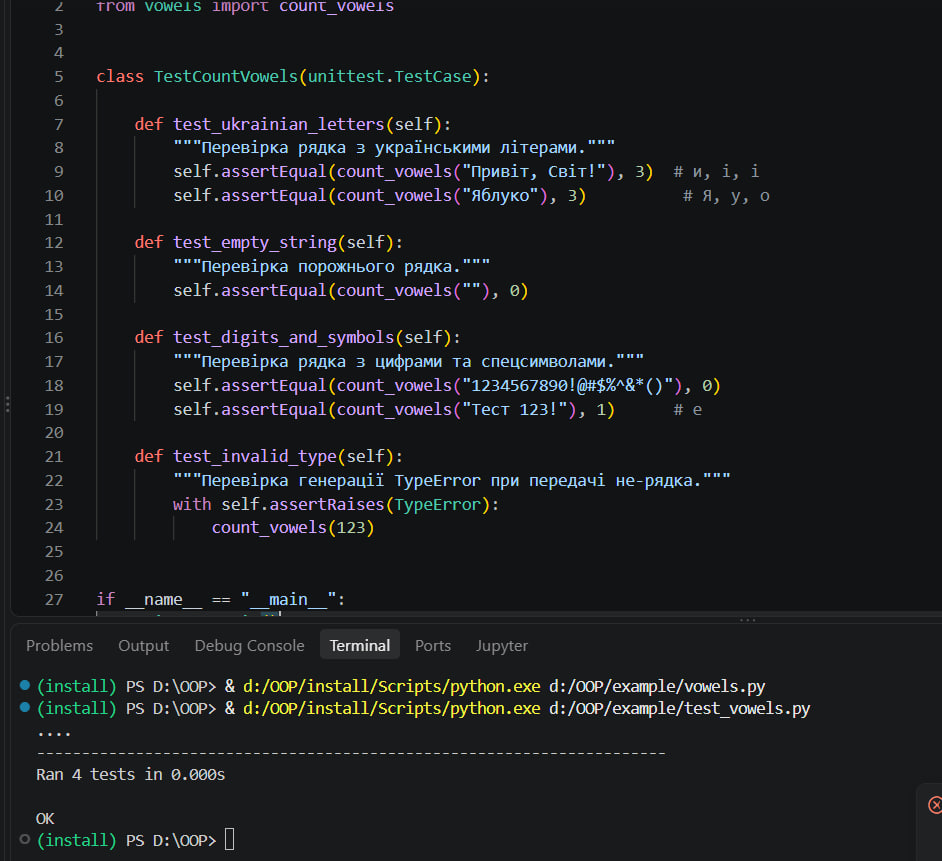
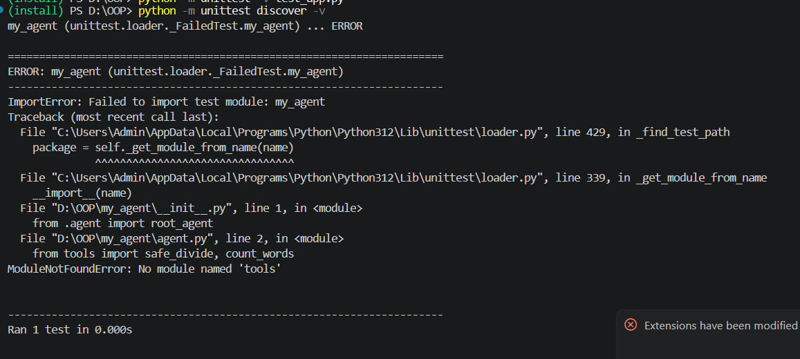
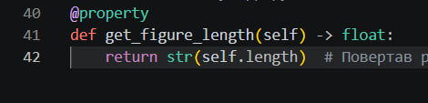
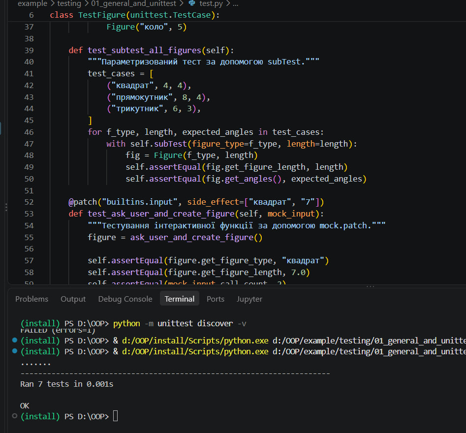
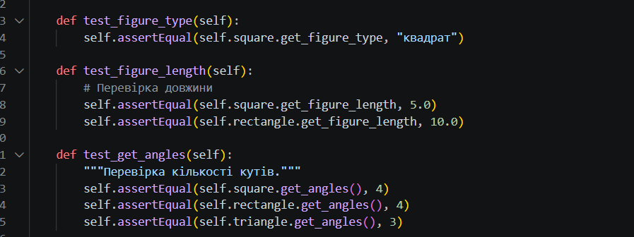

# Звіт до роботи

**Тема:** Загальне тестування та юніт-тести у Python  
**Мета роботи:** Ознайомитися з основними підходами до тестування програмного забезпечення у Python, навчитися перевіряти вхідні дані за допомогою `assert` та `raise`, розробляти юніт-тести за допомогою модуля `unittest`, використовувати `subTest` для параметризації та `unittest.mock` для підміни зовнішніх залежностей.

---

## Виконання роботи

### Завдання 1. Перевірка даних (`assert` та `raise ValueError`)
Створили власну перевірку введеного числа. Використали `raise ValueError` для інформування користувача про некоректний аргумент (число $\le 0$) та `assert` для внутрішнього інваріанта програми.

> **Скріншот коду та результатів роботи (Правильне та неправильне введення):**

---

### Завдання 2. Тестування функції підрахунку голосних літер
Написали функцію для підрахунку голосних літер та створили клас тестів на основі `unittest.TestCase`. Додали перевірки для звичайного тексту, українських літер, порожнього рядка, цифр/символів та некоректного типу даних.

> **Скріншот коду функції та тестів підрахунку голосних:**


---

### Завдання 3. Перший приклад (`Figure`), пошук та виправлення помилки
Відкрили приклад із класом `Figure`, розкоментували тест довжини `test_figure_length` та запустили тести. Виявили помилку в реалізації властивості `get_figure_length` (повертався некоректний тип/значення) та успішно її виправили.

> **Скріншот помилки тестування до виправлення (FAILED):**


> **Скріншот виправленого коду та успішного проходження тесту (OK):**



---

### Завдання 4. Метод `get_angles` та додаткові тести фігур
Додали до класу `Figure` метод `get_angles()` (повертає 4 для квадрата й прямокутника, 3 для трикутника). Написали нові тести для цього методу, а також перевірки винятків `ValueError` для нульової довжини, від'ємної довжини та невідомого типу фігури.

> **Скріншот коду методу get_angles та тестів для граничних значень:**


---


## Результати виконання та пояснення

**Команди запуску тестів:**  
- `python -m unittest -v test_app.py` (запуск тестів у розширеному режимі)  
- `python -m unittest discover -v` (автоматичне виявлення та запуск усіх тестів у папці)

**Результат виконання тестів у консолі:**  
```text
test_count_vowels_empty_and_digits (test_app.TestDataValidationAndVowels) ... ok
test_count_vowels_ukrainian (test_app.TestDataValidationAndVowels) ... ok
test_process_number_invalid (test_app.TestDataValidationAndVowels) ... ok
test_process_number_valid (test_app.TestDataValidationAndVowels) ... ok
test_create_figure_from_input (test_app.TestFigure) ... ok
test_figure_length (test_app.TestFigure) ... ok
test_get_angles (test_app.TestFigure) ... ok
test_invalid_parameters (test_app.TestFigure) ... ok
test_subtest_all_figures (test_app.TestFigure) ... ok

----------------------------------------------------------------------
Ran 9 tests in 0.003s

OK
```
### Пояснення використання `subTest` та `unittest.mock`

* **`subTest`**: Дозволяє проводити серію перевірок у циклі всередині одного тестового методу. Головна перевага полягає в тому, що якщо один із наборів даних (наприклад, трикутник) видасть помилку, тестувальник роздрукує конкретний контекст помилки, але продовжуватиме перевіряти решту даних у циклі.
* **`unittest.mock.patch`**: Використовується для підміни зовнішніх залежностей або інтерактивного введення (`input()`). Використовуючи декоратор `@patch`, ми підставляємо віртуальні відповіді користувача (`side_effect=["трикутник", "8"]`), що дозволяє тестувати інтерактивні функції в автоматичному режимі CI/CD без участі людини.

---

## Висновок

У ході лабораторної роботи було виконано розробку та тестування програмного забезпечення у Python з використанням стандартного модуля `unittest`.

Мету роботи досягнуто повністю: ми навчилися реалізовувати перевірку даних через `raise` та `assert`, писати юніт-тести для окремих функцій і класів, проводити налагодження коду на основі звітів про помилки, а також застосовувати розширені інструменти (`subTest` та `unittest.mock.patch`).

Під час виконання роботи отримано нові знання про:
* виявлення помилок у коді за допомогою звітів `unittest` (`AssertionError`, `FAILED`);
* життєвий цикл тестів (`setUp`, `tearDown`);
* перевірку коректного викидання винятків через `assertRaises`;
* параметризоване тестування за допомогою `subTest`;
* підміну функцій введення/виведення через `unittest.mock.patch`.

Усі завдання виконано в повному обсязі, виявлені помилки успішно виправлено, а тести пройшли перевірку зі статусом **OK**.

