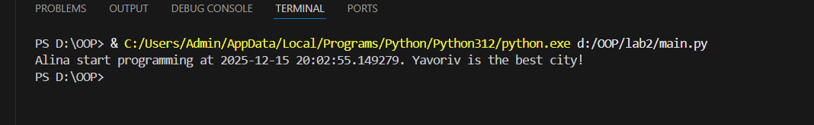
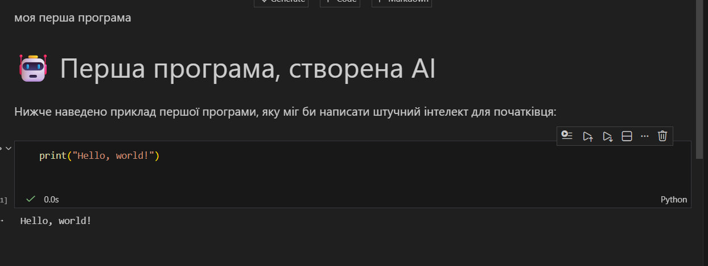

# Звіт до роботи
## Тема: _Вступні заняття: налаштування середовища, прочаток роботи з Python та Markdown;_
### Мета роботи: _Налаштувати середовище роботи VS Code, створити репозиторій Github та налаштувати інтеграцію з ним, написати першу програму на Python та створити звіт з використанням форматування Markdown;_

---
### Виконання роботи
* Результати виконання завданнь;
    1. Налаштували середовище, встановили python, навчились прцювати з Mardown, та починаємо писати програми
    1. Створили файли в яких будемо писати першу програму:  
        - [Файл з програмоб на python](main.py)  
        - [Pyton notebook з інтерактивним   виконанням коду](note.ipymb)
    1. Програма вивела значення :
        
    1. Отримано наступні результати:
        
    1. Навчились налашовувати середовище python, користуватись ipynb, як вставляти гіперпосилання, 

* з використанням URL 
    

* вставлений код / текстовий або числовий результат / інші результати:
1. сворили запит до Copilot який свторив прграму представлену нижче
    ```python
        print("Hello world")
    ```
    - якщо потрібно виділити текст, тоді:
    ```text
    << Тут можна писати те що хочемо виокремити >>
    ```

* результати виконання індивідуального завдання Оформили звіт на завантажилии всі файли у github

---
### Висновок:
## 📊 Висновок

### 1️⃣ Що зроблено в роботі:
- Налаштовано середовище розробки Python у VS Code.
- Встановлено необхідні плагіни: Python, Jupyter, Copilot.
- Створено репозиторій на GitHub та налагоджено інтеграцію з VS Code.
- Написано першу програму на Python та запущено її різними способами.
- Створено Jupyter Notebook із комірками коду та Markdown.
- Отримано та запущено першу програму, створену штучним інтелектом (AI).
- Оформлено звіт з використанням Markdown та завантажено його до репозиторію.

### 2️⃣ Чи досягнуто мети роботи:
✅ Так, усі поставлені цілі були досягнуті.

### 3️⃣ Які нові знання отримано:
- Ознайомився з базовими принципами роботи Python та його запуску.
- Отримав перший досвід роботи з Jupyter Notebook.
- Дізнався, як форматувати текст за допомогою Markdown.

### 4️⃣ Чи вдалось відповісти на всі питання, задані в ході роботи:
✅ Так, усі питання були розглянуті та виконані.

### 5️⃣ Чи вдалося виконати всі завдання:
✅ Так, усі пункти роботи реалізовані та протестовані.

### 6️⃣ Чи виникли складності у виконанні завдання:
Ні

### 7️⃣ Чи подобається такий формат здачі роботи (Feedback):
💡 Так, формат зручний, оскільки поєднує практичні навички програмування, роботу з інструментами розробки та оформлення звіту.


---