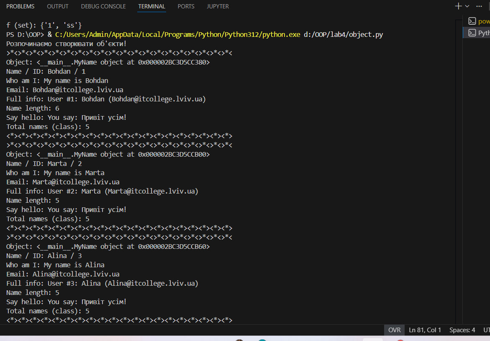

# Звіт до роботи
## Тема: _Знайомство з ООП_
### Мета роботи: _Навчитись використовувати основні принципи ООП, розглянути конструкції побудови класу та створення об'єктів та навчитись працювати з ними_

---
### Виконання роботи
* Результати виконання завдання *1...N*;
    1. Створили два python файли: `.ipynb` та `.py`.
    
    1. Програма вивела значення:
    
    
    1. **Відповіді на контрольні запитання:**
        * **Чому коли передаємо значення `None` створюється об'єкт з іменем `Anonymous`?**
          Це реалізовано безпосередньо в конструкторі __init__. Якщо під час створення об’єкта ім’я не передається або має значення None, спрацьовує відповідна перевірка, у результаті якої викликається класовий метод anonymous_user(). Цей метод створює новий екземпляр класу зі стандартним іменем Anonymous.

        * **Як змінити текст привітання при виклику методу `say_hello`?**
          Метод `say_hello` є статичним (`@staticmethod`), тому він не прикріплений до конкретного об'єкта. Щоб змінити текст, ми передаємо рядок як аргумент при виклику: `MyName.say_hello("Привіт, викладачу!")`.

        * **Чому маємо різну кількість імен (Total names)?**
         Під час виконання роботи було виявлено, що значення класової змінної `total_names` не збігається з кількістю елементів у списку (`Bohdan`, `Marta`, `Alina`, `None`).  
            Це пояснюється тим, що при обробці значення `None` у конструкторі викликається класовий метод `anonymous_user()`, який створює додатковий допоміжний об’єкт з ім’ям **Anonymous**.  
         Під час створення цього об’єкта лічильник `total_names` збільшується, після чого інкремент відбувається ще раз при створенні основного об’єкта.  
            У результаті один елемент зі значенням `None` призводить до подвійного збільшення загального лічильника.

    1. **Навчились:**
        - Працювати зі **змінними класу** (`total_names`), які зберігають спільний стан для всіх об'єктів (глобальний лічильник).
        - Використовувати **змінні екземпляра** (`self.name`) для зберігання унікальних даних конкретного об'єкта.
        - Розуміти різницю між методами екземпляра, статичними методами (`@staticmethod`) та методами класу (`@classmethod`).
        - Аналізувати поведінку конструктора `__init__`: виклики метод