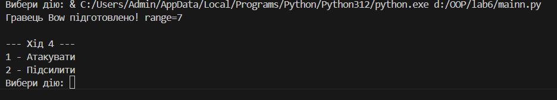

# Звіт до роботи

**Тема:** Основні парадигми об'єктно-орієнтованого програмування у Python  
**Мета роботи:** Ознайомитись з ключовими поняттями ООП у Python та навчитися реалізовувати їх у власних класах на прикладі ігрової симуляції.

---

## Виконання роботи

Розробили програму ігрової симуляції з використанням парадигм ООП.  
Створили базовий абстрактний клас `Item` та дочірні класи `Sword`, `Axe`, `Bow`.  
Програма вивела значення шкоди під час атак та рівень здоров’я персонажів.  
Отримано результати бою залежно від випадкових значень сили удару.  
Навчились використовувати інкапсуляцію, наслідування, поліморфізм та абстракцію у Python.

---

## Вставлені рисунки


---

## Вставлений код

```python
from abc import ABC, abstractmethod
from random import randint, choice

class Item(ABC):
    def __init__(self, name, health=500):
        self.name = name
        self.health = health

    @abstractmethod
    def attack(self, another_item):
        pass


class Sword(Item):
    def __init__(self, name, attack_power):
        super().__init__(name)
        self.__attack_power = attack_power
        self._sharp = 0

    def attack(self, another_item):
        damage = self.__attack_power + self._sharp + randint(0, 10)
        another_item.health -= damage
        return f"{self.name} завдав {damage} шкоди"

    def sharpening(self):
        self._sharp += 1


class Axe(Item):
    def __init__(self, name, attack_power):
        super().__init__(name)
        self.__attack_power = attack_power

    def attack(self, another_item):
        damage = self.__attack_power + randint(0, 20)
        another_item.health -= damage
        return f"{self.name} завдав {damage} шкоди"


class Bow(Item):
    def __init__(self, name, attack_power, range_power=5):
        super().__init__(name)
        self.__attack_power = attack_power
        self.range_power = range_power

    def attack(self, another_item):
        damage = self.__attack_power + randint(5, 15) + self.range_power
        another_item.health -= damage
        return f"{self.name} завдав {damage} шкоди"

    def reload(self):
        self.range_power += 1 ```


player = choice([Sword("Меч", 90), Axe("Сокира", 85), Bow("Лук", 80)])
enemy = choice([Sword("Меч ворога", 90), Axe("Сокира ворога", 85), Bow("Лук ворога", 80)])

print("Твоя зброя:", player.name)
print("Зброя ворога:", enemy.name)

while player.health > 0 and enemy.health > 0:
    action = input("1-Атакувати  2-Підсилити: ")

    if action == "1":
        print(player.attack(enemy))
    else:
        if isinstance(player, Sword):
            player.sharpening()
        elif isinstance(player, Bow):
            player.reload()

    if enemy.health <= 0:
        print("Перемога!")
        break

    print(enemy.attack(player))
```
## Висновок

У ході лабораторної роботи було виконано створення програми ігрової симуляції з використанням основних парадигм об’єктно-орієнтованого програмування: інкапсуляції, наслідування, поліморфізму та абстракції.  

Мету роботи досягнуто повністю: ми змогли реалізувати базовий абстрактний клас та дочірні класи зброї (Sword, Axe, Bow), створити покрокову гру з випадковим вибором зброї та додати підсилення атаки.  

Під час виконання роботи отримано нові знання про:
- використання абстрактних класів у Python,  
- приховування даних у класах (інкапсуляція),  
- перевизначення методів та різну поведінку об’єктів (поліморфізм),  
- наслідування атрибутів і методів базового класу.  

Всі завдання виконані, труднощі були незначні і успішно подолані.  
Формат здачі роботи через репозиторій зручний і дозволяє легко додавати код та скріншоти.  

**Feedback:** формат здачі подобається.  
**Suggestions:** можна додати більше практичних прикладів та покрокових пояснень для новачків.
    